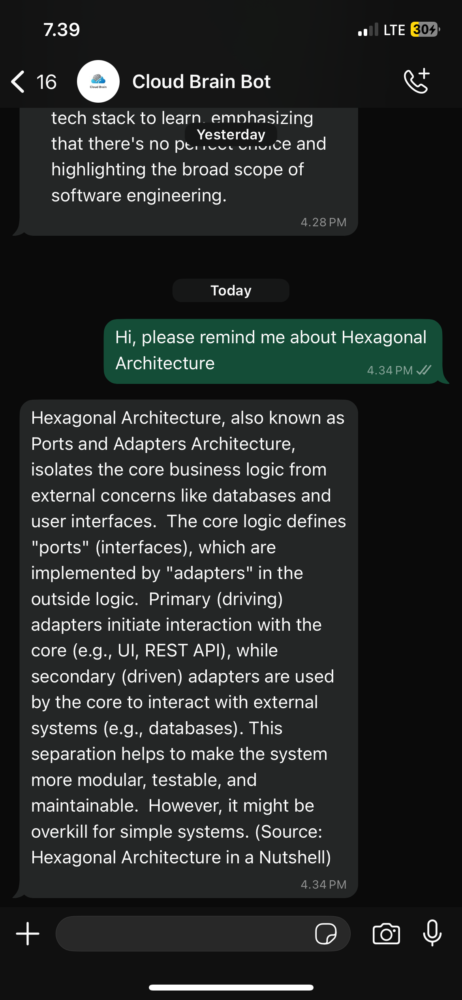

# Cloud Brain

[](https://github.com/sponsors/azis14)
[](https://codecov.io/github/azis14/cloud-brain)
[](https://opensource.org/licenses/MIT)
[](https://www.python.org/)
[](https://fastapi.tiangolo.com/)
[](https://www.mongodb.com/)
[](https://www.notion.com/)
[](https://waha.devlike.pro/)

A FastAPI application that connects to the Notion API and provides RAG (Retrieval-Augmented Generation) capabilities using MongoDB Atlas Vector Search and Google AI Studio.

## Features

### Notion Integration
- 🔗 Connect to Notion API
- 📊 Fetch data from Notion databases
- 📋 Simplified data extraction

### RAG & Vector Search
- 🧠 Sync Notion content to MongoDB Atlas as vector embeddings
- 🔍 Vector similarity search using sentence transformers
- 🤖 Question answering with Google AI Studio (Gemini)
- 💬 Chat interface for natural language queries

## Setup

### 1. Environment Variables

Create a `.env` file in the project root with the following configuration:

```env
# Notion API Configuration
NOTION_API_KEY=your_notion_integration_token_here
NOTION_DATABASE_IDS=your_comma_separated_database_ids_here

# MongoDB Atlas Configuration
MONGODB_URI=your_url_to_mongodb_atlas_cluster_here
MONGODB_DATABASE=your_database_name_here
MONGODB_COLLECTION=your_collection_name_here

# Google AI Studio Configuration
GOOGLE_API_KEY=your_google_ai_studio_api_key (optional, could use another LLM)
GOOGLE_MODEL=(gemini-1.5-flash or other model)

# Vector Database Configuration (Optional - defaults provided)
EMBEDDING_MODEL=all-MiniLM-L6-v2
MAX_CHUNK_TOKENS=500
CHUNK_OVERLAP_TOKENS=50
MAX_CONTEXT_CHUNKS=5
MIN_SIMILARITY_SCORE=0.7

# Other Configurations
CORS_ALLOW_ORIGINS=could be '*' or specific origins here
API_SECRET_KEY=generate_random_string_here

# WAHA configuration
WHITELISTED_NUMBERS=your_comma_separated_phone_numbers_here
WAHA_API_URL=your_url_to_waha_api_here
WAHA_API_KEY=your_waha_api_key_here
WAHA_SESSION_NAME=your_waha_session_name_here
```

### 2. MongoDB Atlas Setup

1. Create a MongoDB Atlas cluster
2. Create a database
3. Create a collection
4. **Important**: Create a vector search index:
   - Index name: `vector_index`
   - Field path: `embedding`
   - Dimensions: `384` (for all-MiniLM-L6-v2 model)
   - Similarity: `cosine`

### 3. Install Dependencies

```bash
pip install -r requirements.txt
```

### 4. Run the Application

```bash
uvicorn main:app --reload
```

The API will be available at `http://localhost:8000`

## API Documentation

Once the server is running, visit:
- **Interactive API docs**: `http://localhost:8000/docs`
- **ReDoc documentation**: `http://localhost:8000/redoc`

## Notion Integration Setup

1. Go to [Notion Integrations](https://www.notion.so/my-integrations)
2. Click "New integration"
3. Give it a name and select your workspace
4. Copy the "Internal Integration Token" - this is your `NOTION_API_KEY`
5. Share your databases with the integration:
   - Open the database in Notion
   - Click "Share" → "Invite"
   - Search for your integration name and invite it

## WAHA (WhatsApp HTTP API) Setup

WAHA enables WhatsApp integration, allowing your application to receive and respond to WhatsApp messages with AI-generated answers based on your Notion content.

### Quick Setup

1. **Install and run WAHA** using Docker:
   ```bash
   docker pull devlikeapro/waha
   docker run -it --rm -p 3000:3000 --name waha devlikeapro/waha
   ```

2. **Connect WhatsApp**: Open `http://localhost:3000`, create a session, and scan the QR code with your phone.

3. **Configure environment variables** in your `.env` file:
   ```env
   WAHA_API_URL=http://localhost:3000
   WAHA_API_KEY=your_waha_api_key_here
   WAHA_SESSION_NAME=default
   WHITELISTED_NUMBERS=1234567890,9876543210
   ```

4. **Set webhook URL** in WAHA dashboard to: `http://your-app-domain.com/waha/webhook`

### How it works
- Incoming WhatsApp messages are sent to your application via webhook
- Only whitelisted numbers can interact with the bot
- Messages are processed through the RAG system and responses are sent back via WhatsApp

For detailed installation, configuration, and production deployment instructions, visit the [WAHA official documentation](https://waha.devlike.pro/docs/overview/quick-start).

### Host Waha on Sumopod

Instead of running WAHA locally, you can host WAHA+ on SumoPod, which offers low cost hosting (starts from IDR20K/month) for small projects like this one. Follow these steps:
- Sign up for an account on [SumoPod](https://sumopod.com/register?ref=397bb660-81e6-48b8-919d-c0868301d72f)
- Deploy your WAHA instance by clicking the "Deploy Now" button below.
- Once deployed, follow the setup guide above to configure your WAHA instance.

## Development

### Running Tests

```bash
# Install test dependencies
pip install pytest pytest-asyncio httpx

# Run tests (when test files are created)
pytest
```

### Contributing

1. Fork the repository
2. Create a feature branch
3. Make your changes
4. Add tests if applicable
5. Submit a pull request

## License

This project is open source and available under the MIT License.

## Example Usage
<a href="./assets/example_1.PNG" target="_blank">
    
</a>

## 📮 Support

[](https://clicky.id/azis14/support/coffee)
[](https://www.azis14.my.id/)

If you encounter any issues or have questions, please [open an issue](https://github.com/azis14/devto-badge/issues) on GitHub.

If you like this repo or think it useful, please leave a ⭐️ on it.

---

Made with ❤️ by the open-source community